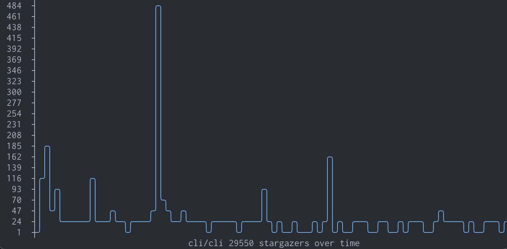

# gh-stars 🌟

A GitHub CLI extension to show repository stargazers.



## Installation

1. Make sure you have [gh-cli](https://github.com/cli/cli#installation) installed.
2. Install the extension:

```bash
$ gh extension install aymanbagabas/gh-stars
```

## Usage

```bash
$ gh stars                     # while in a GitHub repository
$ gh stars [GitHub repository] # to view a specific GitHub repository
```

### Keybindings

- <kbd>tab</kbd> - Switch between graph &table view.
- <kbd>a</kbd> - toggle all stargazers.
- <kbd>left</kbd> - increase time.
- <kbd>right</kbd> - decrease time.
- <kbd>?</kbd> - Show help.
- <kbd>q</kbd> - Quit.
- <kbd>↑↓</kbd> - Navigate table view.
